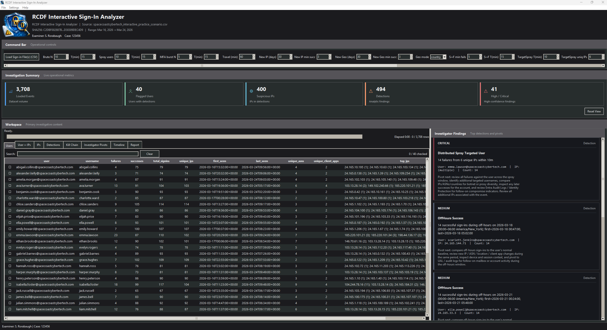
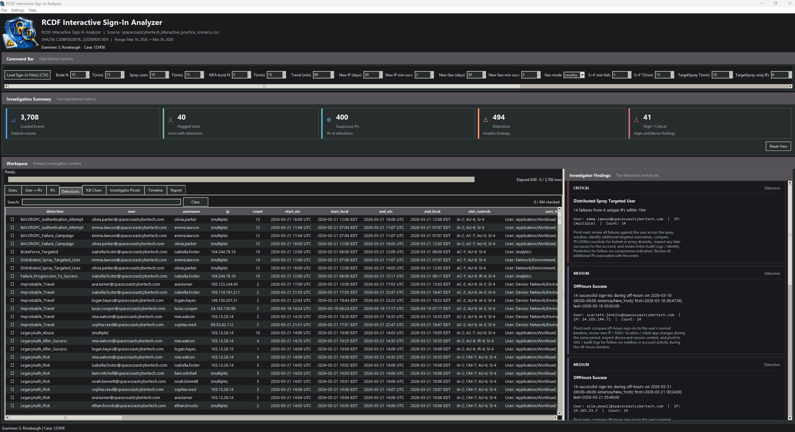
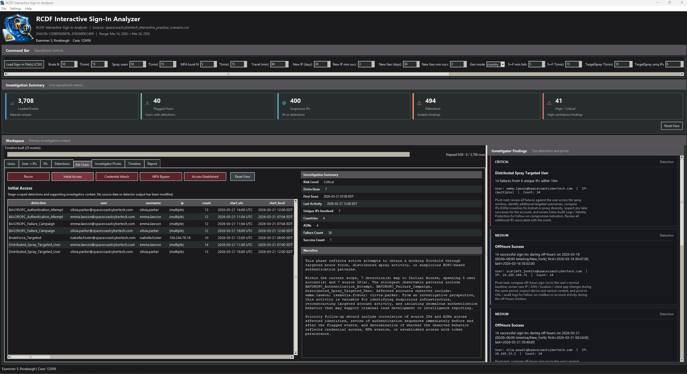
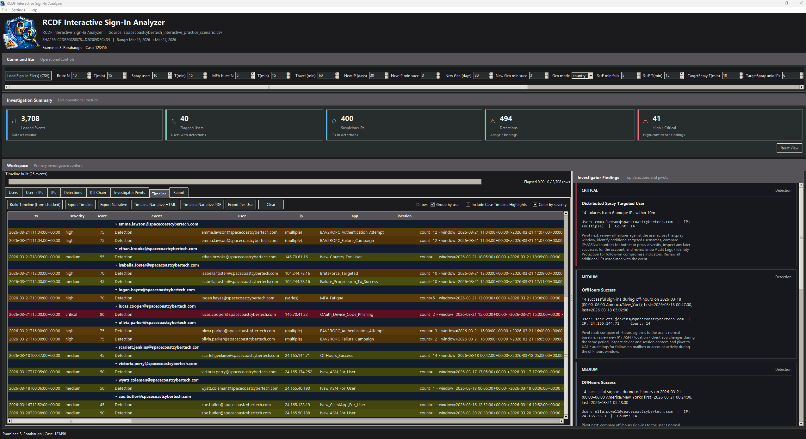
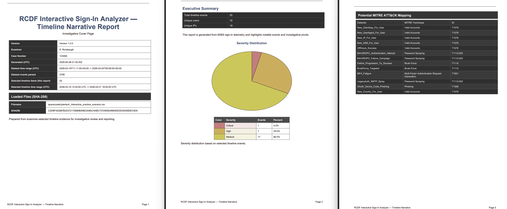

# RCDF Interactive Sign-In Analyzer

The RCDF Interactive Sign-In Analyzer is an independently developed DFIR tool designed to assist with review and analysis of Microsoft interactive sign-in telemetry.

The tool is focused on helping investigators move from raw authentication logs to structured investigative output, including enrichment, detections, timeline reconstruction, and report-ready findings.

---

---

## Screenshots

### Dashboard

### Detections

### Kill Chain View

### Timeline

### Reporting

---

## Features

- Microsoft interactive sign-in log analysis
- IP address enrichment
- Suspicious sign-in detection workflows
- Timeline reconstruction
- Identity-focused kill chain mapping
- NIST and Zero Trust Architecture reference mapping
- Report generation and export support
- File hashing support for evidentiary tracking
- Investigator-focused dashboard and triage workflows

---

## Intended Use

This tool is intended to support digital forensics, incident response, authentication telemetry review, and investigative analysis workflows.

Detection output should be reviewed in context and validated against available evidence, tenant configuration, and additional log sources where appropriate.

---

## Downloads

Download the latest release from the repository Releases section.

Release package includes:

- Windows standalone executable
- Sample test data

---

## Documentation

- [Getting Started](docs/getting_started.md)
- [Detections](docs/detections.md)
- [Reporting](docs/reporting.md)

---

## Sample Data

Synthetic and sanitized sample datasets are available separately for testing and demonstration purposes.

---

## Disclaimer

This tool is an independent project developed by Steve Rorabaugh.

It is not affiliated with, endorsed by, or sponsored by any government agency, employer, or third-party organization.

The tool is provided as-is for research, educational, and investigative workflow purposes. Users are responsible for validating findings and ensuring appropriate use within their own environments and legal authorities.
